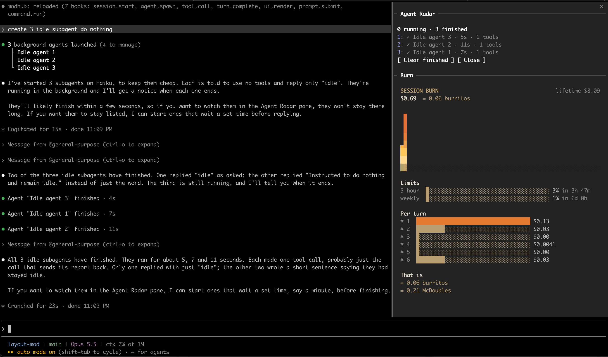

# modhub

**Fit small Claude Code mods into one pane.**

On its own, each mod opens its own pane, and that pane takes up the whole space even when the mod shows just two lines. modhub puts small mods into one pane.



*Two small mods, [Agent Radar](https://github.com/hamzafer/claude-code-mods) and [Burn Meter](https://github.com/OneWave-AI/claude-code-mods), share one pane (right). On their own, each would take the whole pane.*

## Get started (3 minutes)

**1. Install the kit** (once):

```
/plugin marketplace add wyushi/modhub
/plugin install modhub-kit@modhub
/modhub-kit:setup
```

Restart Claude Code.

**2. Add a mod.** A fresh Hub is empty. Try Agent Radar by [hamzafer](https://github.com/hamzafer/claude-code-mods):

```
/modhub-kit:install https://github.com/hamzafer/claude-code-mods mods/agent-radar
```

Claude shows you what the mod does and asks you to confirm. Then it asks what to show (pane, band, toasts, status).

**3. Open the Hub:**

```
/hub
```

That's it. Close it with `Ctrl+X` then `X`. Resize it with `Ctrl+X` then an arrow.

> Tip: in fullscreen (`/tui fullscreen`, 110+ columns wide) the Hub docks on the right like the screenshot. Otherwise it opens above the prompt.

In the Claude desktop app, `/hub` works too. The command list may say "/hub isn't a command here"; send it anyway.

## Everyday commands

| You want to… | Run |
| --- | --- |
| Open the Hub | `/hub` |
| Install a new mod (git URL or local folder) | `/modhub-kit:install <url> [subfolder]` |
| Show a mod, or one of its outputs | `/modhub-kit:add <mod> [pane\|band\|toasts\|status]` |
| Hide a mod (keeps its code) | `/modhub-kit:disable <mod> [pane\|band\|toasts\|status]` |
| Delete a mod | `/modhub-kit:uninstall <mod>` |
| Rebuild after editing config by hand | `/modhub-kit:sync` |

You can also just ask, for example "hide the snake mod" or "put Agent Radar in the Hub".

## Two rules

- Don't also install a mod on its own once the Hub runs it. Its commands and toasts would show up twice.
- An installed mod's code runs with the Hub's access. Read what install shows you before you confirm.

## More

Outputs, file locations, editing the layout by hand, limits and troubleshooting: see the [reference](docs/reference.md).

## License

MIT, see [LICENSE](LICENSE). Mods you install are separate projects with their own licenses.
